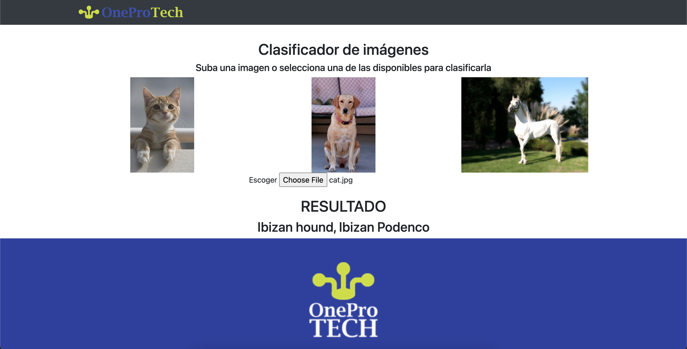

# Clasificador de imágenes usando Flask y TensorFlowJS MobileNET
Puedes clasificar las imagenes disponibles o subir cualquier imagen para clasificarla usando TensorFlowJS MobileNET

## Demo
 <br>
 <br>


## Pasos para utilizar el demo

```shell
git clone .git
```

```shell
pip install -r requirements.txt
```

### Ejecutar con Python

```shell
python app.py
```

### Ejecutar con Flask
```shell
$ flask run
```

### Abrir el navegador
- Visitar la siguiente ruta: http://localhost:5000